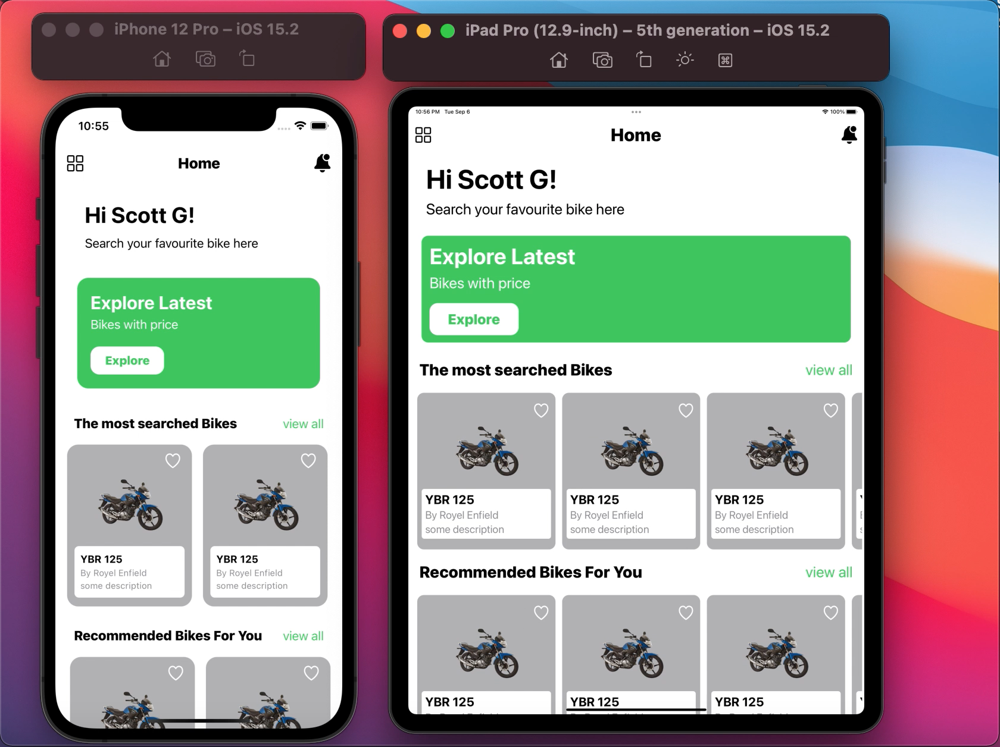

# SizeClassesSwiftUI

This is a basic overview of using size classes to build adoptive layout in SwiftUI. 

SwiftUI provides us **@Environament** property wrapper for both horizontalSizeClass and verticalSizeClass. Firstly we need to store value in like below

```sh
   @Environment(\.horizontalSizeClass) var horizontalSizeClass
   @Environment(\.verticalSizeClass) var verticalSizeClass
 ```
Then we can check for the value 

```
  if horizontalSizeClass == .compact {
     print("compact")
  }

  if horizontalSizeClass == .regular {
     print("regular")
  }
```

If you want to know more about **Device size classes** based on orientation then check out Layout section in Human interface guidelines here https://developer.apple.com/design/human-interface-guidelines/foundations/layout/

Size Classes are super useful to create adoptive design along differnt screen sizes. Here is an example of dummy UI on IPhone12 pro and IPad pro 12.9 inches.




## Contact

Follow on Twitter - [Naqeeb Ahmed](https://twitter.com/naqeeb108)

Connect on LinkedIn - [Naqeeb Ahmed](https://www.linkedin.com/in/naqeeb-ahmed-7ba469128)

Leave a message - ahmed.naqeeb108@gmail.com

## Acknowledgments

Following resources i found helpful. please do check out to learn more.

* [Hacking With Swift](https://www.hackingwithswift.com/quick-start/swiftui/how-to-create-different-layouts-using-size-classes)
* [Size Classes - SwiftUI - Adopt Landscape Example](https://www.youtube.com/watch?v=fyhYRkTIzoM)
* [Changing a view’s layout in response to size classes](https://www.youtube.com/watch?v=kBGtBaNxzIM)
